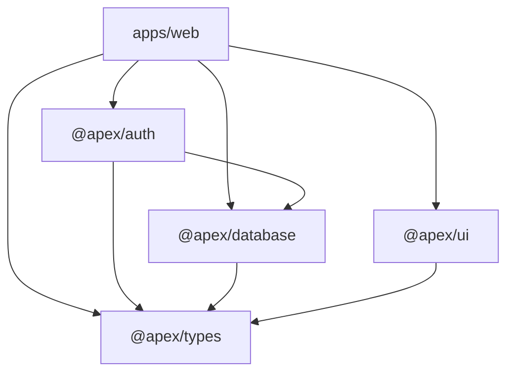

# Architecture

> Status: **Foundation** · Last updated: 2026-08-02
>
> This document describes the system as it is built today, plus the decisions
> that shaped it. Sections marked _TBD_ are placeholders for the next phase.

## Contents

1. [Guiding principles](#1-guiding-principles)
2. [Repository layout](#2-repository-layout)
3. [Layering model](#3-layering-model)
4. [Feature-sliced structure](#4-feature-sliced-structure)
5. [Data flow](#5-data-flow)
6. [Multi-tenancy](#6-multi-tenancy)
7. [Package dependency graph](#7-package-dependency-graph)
8. [Architecture decisions](#8-architecture-decisions)
9. [Known gaps](#9-known-gaps)

---

## 1. Guiding principles

| Principle                          | What it means in practice                                                                                                                                    |
| ---------------------------------- | ------------------------------------------------------------------------------------------------------------------------------------------------------------ |
| **Types flow end to end**          | Prisma → tRPC → React Query → component props. No hand-written API clients, no `any` at a boundary.                                                          |
| **Boundaries are explicit**        | A package's public surface is its `exports` map. Deep imports into another package's `src/` are not allowed.                                                 |
| **Tenancy is not an afterthought** | `organizationId` exists in the schema and in the tRPC context from day one. Retrofitting tenancy is the single most expensive migration a B2B SaaS can face. |
| **Fail at build time**             | Env vars are Zod-validated, TypeScript runs in strict mode, and the pre-push hook typechecks. Errors should surface before deploy, not in production.        |
| **Delete-ability**                 | A feature slice should be removable by deleting one directory plus one router entry.                                                                         |

## 2. Repository layout

```text
apex-os/
├── apps/
│   └── web/                  # Next.js App Router application (the only deployable)
├── packages/
│   ├── auth/                 # Better Auth server + client, permission model
│   ├── config/               # Shared ESLint / TypeScript presets (no runtime code)
│   ├── database/             # Prisma schema, generated client, tenant helpers
│   ├── types/                # Framework-agnostic domain types & Zod primitives
│   └── ui/                   # Design system: tokens, theme, shadcn/ui primitives
├── docs/                     # This documentation set
└── <root tooling>            # turbo, pnpm workspace, prettier, husky, commitlint
```

**Why a monorepo?** The platform will grow beyond one deployable — a marketing
site, a mobile/BFF surface, and a Trigger.dev worker project are all on the
roadmap. Sharing the database schema, the auth model and the design system
across those via published npm packages would mean version-bumping four
repositories to ship one feature. Turborepo gives us the shared code without
the release overhead, and `pnpm` workspaces keep `node_modules` cheap.

**Why only one app today?** Adding `apps/marketing` before there is marketing
copy is speculative structure. The monorepo makes adding it a 10-minute job
later; adding it now costs a build target we have to keep green for no benefit.

## 3. Layering model

Dependencies point **downward only**. A lower layer never imports an upper one.

```text
┌──────────────────────────────────────────────────────────┐
│  UI            app/ · components/ · features/*/components │  React, presentational
├──────────────────────────────────────────────────────────┤
│  Business      features/*/server · server/api/routers     │  tRPC procedures, use-cases
├──────────────────────────────────────────────────────────┤
│  Services      services/ · integrations/                  │  R2, Resend, PostHog, Trigger
├──────────────────────────────────────────────────────────┤
│  Data          @apex/database (Prisma)                    │  the only SQL boundary
└──────────────────────────────────────────────────────────┘
                 @apex/types · @apex/ui · @apex/auth  ← cross-cutting
```

| Layer              | Location                                        | Rule                                                                                                               |
| ------------------ | ----------------------------------------------- | ------------------------------------------------------------------------------------------------------------------ |
| **UI**             | `app/`, `components/`, `features/*/components/` | May call tRPC hooks. Must not import Prisma or `@apex/database`.                                                   |
| **Business logic** | `features/*/server/`, `src/server/api/routers/` | Owns authorization, validation and orchestration. The only layer that composes services + data.                    |
| **Services**       | `src/services/`                                 | Internal capabilities (e.g. `storage`, `mailer`). Pure functions over an SDK, no HTTP framework awareness.         |
| **Integrations**   | `src/integrations/`                             | Third-party SDK clients and their configuration. One directory per vendor, so swapping a vendor touches one place. |
| **Data**           | `packages/database`                             | Prisma client singleton + tenant-scoping helpers. Nothing else opens a DB connection.                              |

**Services vs. integrations** is a distinction worth spelling out because it is
not obvious: an _integration_ is "how we talk to Resend"; a _service_ is "how
Apex OS sends a transactional email". The service is the stable interface the
business layer depends on; the integration is the swappable detail underneath.

## 4. Feature-sliced structure

Each domain owns a vertical slice under `apps/web/src/features/`:

```text
features/athletes/
├── components/     # UI local to this feature
├── hooks/          # client-side state & data hooks
├── server/         # tRPC router, use-cases, authorization
├── schemas/        # Zod input/output contracts
└── types.ts        # feature-local types
```

Cross-feature reuse is promoted, not shortcut: if `assessments` needs something
from `athletes`, the shared piece moves up into `components/`, `src/lib/` or a
`packages/*` — features do not import from each other's internals. Permitted
dependencies go exclusively through a slice's public `index.ts`. This keeps the
dependency graph a tree rather than a mesh, which is what makes slices
independently deletable.

Slice names follow the domain model in
[docs/domain/DOMAIN_DECISIONS.md](./domain/DOMAIN_DECISIONS.md).

| Group                      | Slices                                                                            |
| -------------------------- | --------------------------------------------------------------------------------- |
| **Domain core**            | `athletes` · `cases` · `assessments` · `insights` · `recommendations` · `reports` |
| **Supporting objects**     | `documents` · `videos` · `programs` · `notes` · `appointments`                    |
| **Cross-cutting surfaces** | `timeline` · `portal`                                                             |
| **Frame**                  | `auth` · `dashboard` · `settings`                                                 |

Two domain objects live inside the slice that owns their lifecycle rather than
as top-level slices:

- `assessments/measurements` — a Measurement always belongs to exactly one
  Module, and through it to exactly one Assessment.
- `reports/sharing` — sharing is what happens to a Report after publication.

**Not slices:** assessment modules (`running`, `lactate`, `nutrition`, …) are
data plus a registry in `packages/domain`, so a new module never requires a
change under `features/`. The Measurement Type catalogue belongs to
`packages/domain` as well; `settings` only provides its administration surface.

## 5. Data flow

**Reads (server component):** RSC → `trpc/server.ts` caller → router → Prisma →
serialized into the client via React Query hydration.

**Reads (client):** component → `useQuery` (tRPC + TanStack Query) →
`/api/trpc/[trpc]` → router → Prisma.

**Writes:** Server Action _or_ tRPC mutation → Zod validation → authorization
check → use-case → Prisma → cache invalidation.

**When to use which:** Server Actions for form submissions tied to one route
(progressive enhancement, no client JS required). tRPC for everything the
client needs to call imperatively, for optimistic updates, and for anything a
future second client (mobile, worker) would also need. Both funnel through the
same use-case functions in `features/*/server/`, so the validation and
authorization rules live in exactly one place regardless of transport.

## 6. Multi-tenancy

Model: **shared database, shared schema, row-level `organizationId`.**

- Every tenant-owned table carries `organizationId` with an index. A composite
  index satisfies this when `organizationId` is its first column.
- **Two deliberate exceptions.** Pure join tables carry no tenant column — they
  are only ever reached through a tenant-scoped parent. And `Coach` /
  `CoachCredential` are not tenant-scoped at all: a coach profile is
  organisation-independent (DOMAIN_DECISIONS §6), affiliation runs through
  `Membership`. Everything a coach _authors_ is tenant-scoped; the person is not.
- The tRPC context resolves the active organization from the session, and
  `organizationProcedure` injects it — procedures receive a scoped context
  rather than reaching for the session themselves.
- `packages/database/src/tenant.ts` holds the scoping helpers. All tenant reads
  go through them so a forgotten `where` clause is a code-review-visible
  deviation rather than a silent cross-tenant leak.

**Why not schema-per-tenant?** Migration cost grows linearly with tenant count
and Prisma has no first-class support for it. Row-level scoping is the standard
choice at this stage; if a large customer later demands physical isolation,
the `organizationId` boundary is exactly what makes extracting them tractable.

_TBD:_ Postgres RLS as a defense-in-depth second layer behind the application
scoping.

### Athlete access — the second scoping layer

`organizationId` answers _which workspace am I in_. A second question sits
inside it: **which athletes may this coach see?**

Today the answer is trivial — one coach per workspace (DOMAIN_DECISIONS §5), so
it is "all of them". It will not stay that way. Once a workspace holds several
coaches, an athlete is visible to a coach only after granting consent: complete,
retroactive and revocable, and never on the coach's behalf.

**The convention, from the first athlete-facing procedure onwards:** feature
code never answers that question itself. Two helpers do.

| Helper                                | Answers                 | Used for                                  |
| ------------------------------------- | ----------------------- | ----------------------------------------- |
| `accessibleAthleteIds(ctx)`           | which athletes are mine | lists, rosters, dashboards                |
| `assertAthleteAccess(ctx, athleteId)` | may I reach this one    | every entry point that loads athlete data |

Both live next to the tenant helpers in `packages/database/src/tenant.ts`. Today
they are deliberately no-ops — "every athlete in the workspace", "always yes".

**Why introduce an abstraction that currently does nothing.** Because the
alternative is not "add it later", it is "audit every query later". Every Case,
Assessment, Measurement, Report, Document and timeline read reaches athlete
data. By the time consent ships, that is a hundred call sites, and a single
missed one exposes special-category health data to a coach who has no consent —
a reportable incident, not a bug.

**Why two helpers are enough.** Everything hangs off an athlete through the
canonical chain (Athlete → Case → Assessment → Module → Measurement). Checking
the athlete once at the entry point covers everything below it, because nothing
below is reachable without passing through. The check does not have to be
repeated per query — it has to exist at the boundary.

Consent is per-athlete and all-or-nothing, which is what keeps this to two
functions rather than a permission matrix.

This layer is **not** about separating athletes from one another. That
separation comes from the chain itself and was never at risk.

## 7. Package dependency graph



`@apex/config` sits outside the runtime graph — it is consumed as devDependency
tooling presets only.

## 8. Architecture decisions

Short-form ADRs. Each records the decision, the reasoning, and what would make
us revisit it.

### ADR-001 — Turborepo + pnpm workspaces

**Decision:** Monorepo with pnpm workspaces, Turborepo for task orchestration.
**Why:** Content-hash caching makes CI fast, `dependsOn: ["^build"]` gets build
ordering right by default, and pnpm's symlinked store keeps disk and install
time low across many packages.
**Revisit if:** the repo grows past ~10 apps and remote caching stops paying
for the config overhead.

### ADR-002 — tRPC alongside Server Actions

**Decision:** Use both, over a shared use-case layer.
**Why:** Server Actions are the better fit for forms and progressive
enhancement; tRPC is the better fit for typed imperative calls, optimistic
updates and future non-web clients. Rejecting either would cost us something
real. Routing both through `features/*/server/` prevents the duplication that
normally makes "use both" a bad idea.
**Revisit if:** the app never grows a second client and Server Actions cover
every case — then tRPC is removable surface area.

### ADR-003 — Better Auth over NextAuth/Clerk

**Decision:** Better Auth, self-hosted, with the organization plugin.
**Why:** First-class multi-tenant organization/membership/invitation primitives
that we would otherwise hand-roll; data stays in our own Postgres (no per-MAU
pricing, no vendor as a hard availability dependency); a Prisma adapter that
keeps auth tables in the same migration history as domain tables.
**Trade-off:** we own the security surface (session handling, rate limiting,
recovery flows) that a managed vendor would own.
**Revisit if:** enterprise SSO/SCIM requirements arrive and building them costs
more than a vendor.

### ADR-004 — Tailwind v4 with CSS-variable tokens

**Decision:** Semantic CSS variables in `@apex/ui`, consumed by Tailwind's
`@theme` — not a `tailwind.config.ts` colour object.
**Why:** Theming becomes a runtime concern (swap variables under a selector)
rather than a build concern. Same tokens are readable by non-Tailwind
consumers — charts, emails, canvas rendering.
**Revisit if:** we need per-tenant white-labelling, which extends this approach
rather than replacing it.

### ADR-005 — Zod-validated environment

**Decision:** `@t3-oss/env-nextjs` with Zod schemas in `apps/web/src/env.ts`.
**Why:** Misconfiguration is the most common deploy failure, and the default
failure mode (`undefined` reaching runtime) is the hardest to debug. Validation
turns it into a build-time error naming the variable.

## 9. Known gaps

Deliberate omissions at foundation stage, tracked so they are not mistaken for
oversights:

- No CI pipeline (`.github/workflows/`) yet — see [DEPLOYMENT.md](./DEPLOYMENT.md).
- No rate limiting on the auth or tRPC surface — see [SECURITY.md](./SECURITY.md).
- No observability/error tracking wiring beyond PostHog analytics.
- Test setup exists (Vitest) but there is no meaningful test suite — see
  [TESTING.md](./TESTING.md).
- Postgres RLS not enabled; tenant isolation is application-level only.
- Consent-based athlete assignment is not implemented — the two access helpers
  in §6 exist as no-ops so that adding it stays a one-place change.

---

**Related:** [DATABASE.md](./DATABASE.md) · [API.md](./API.md) ·
[SECURITY.md](./SECURITY.md) · [DESIGN_SYSTEM.md](./DESIGN_SYSTEM.md)
