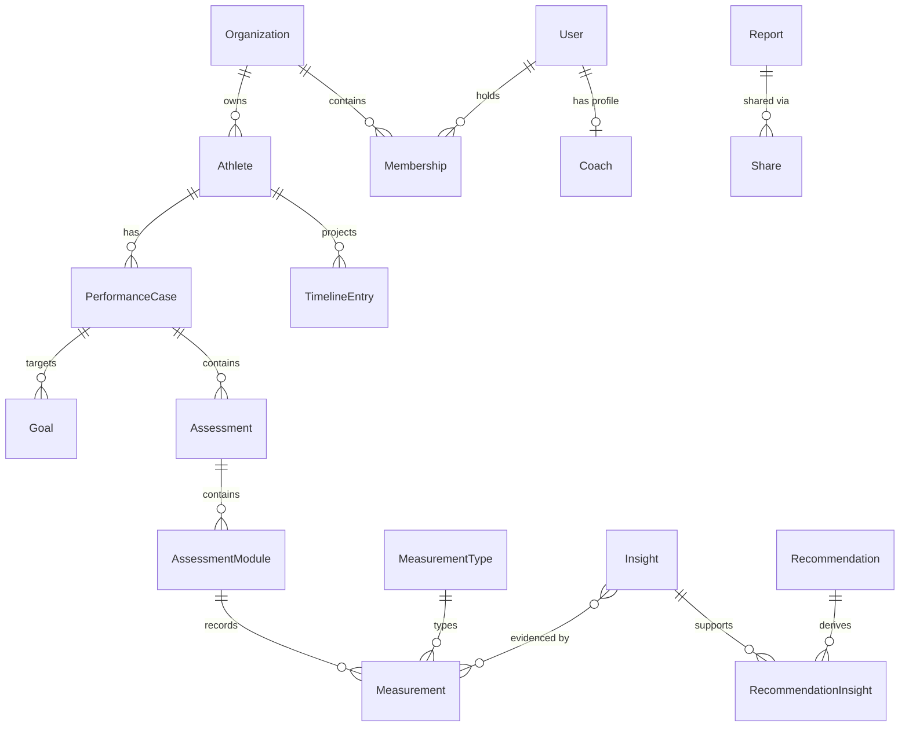

# Database

> Status: **Domain schema, first migration applied** · Last updated: 2026-08-09
>
> Source of truth: [`packages/database/prisma/schema.prisma`](../packages/database/prisma/schema.prisma).
> The schema carries the full rationale per model as `///` comments with `§`
> references into [`docs/domain/DOMAIN_DECISIONS.md`](./domain/DOMAIN_DECISIONS.md).
> This document is the map, not the territory.

## Contents

1. [Stack](#1-stack)
2. [Tenancy model](#2-tenancy-model)
3. [Schema](#3-schema)
4. [Conventions](#4-conventions)
5. [Invariants requiring raw SQL](#5-invariants-requiring-raw-sql)
6. [Client access](#6-client-access)
7. [Migrations](#7-migrations)
8. [Local setup](#8-local-setup)
9. [Seeding](#9-seeding)
10. [Performance](#10-performance)

---

## 1. Stack

| Concern       | Choice                                                                        |
| ------------- | ----------------------------------------------------------------------------- |
| Engine        | PostgreSQL 16+ (Supabase, `eu-central-1`)                                     |
| ORM           | Prisma 7 (`prisma-client` generator, ESM output)                              |
| Driver        | `@prisma/adapter-pg` driver adapter                                           |
| Client output | `packages/database/generated/prisma` (gitignored)                             |
| Config        | [`packages/database/prisma.config.ts`](../packages/database/prisma.config.ts) |
| Connection    | `DATABASE_URL` (pooled, runtime) · `DIRECT_URL` (unpooled, migrations)        |

**Why two URLs?** Serverless functions open many short-lived connections, which
exhausts Postgres' connection limit — so runtime goes through a pooler
(PgBouncer/Neon/Supabase). But Prisma Migrate needs session-level features a
transaction pooler does not support, so DDL goes direct. With a plain
non-pooled Postgres, set both to the same value.

## 2. Tenancy model

**Shared database · shared schema · `organizationId` discriminator.**

Every tenant-owned row carries `organizationId`, indexed. The active tenant is
resolved from `Session.activeOrganizationId` — deliberately on the session, not
the user, because one person may coach for several organizations and must be
able to switch without ambiguity.

Rationale and rejected alternatives: [ARCHITECTURE.md §6](./ARCHITECTURE.md#6-multi-tenancy).

Two documented exceptions to "every row carries `organizationId`" — see
[§4](#4-conventions).

## 3. Schema

30 models, 15 enums. The canonical hierarchy (§3) is:

```
Workspace → Athlete → Performance Case → Assessment → Module → Measurement
```

`Workspace` is modelled as `Organization` (§5): a Personal Workspace is
internally an Organization, and that stays invisible to the user.



### Identity (Better Auth)

| Model          | Table           | Purpose                                    |
| -------------- | --------------- | ------------------------------------------ |
| `User`         | `users`         | Identity record                            |
| `Session`      | `sessions`      | Active sessions + `activeOrganizationId`   |
| `Account`      | `accounts`      | Credential and OAuth provider links        |
| `Verification` | `verifications` | Email verification & password reset tokens |

> Field names in these four models are dictated by the Better Auth Prisma
> adapter. **Do not rename them** — the adapter maps by field name.

### Tenancy

| Model          | Table           | Purpose                                                |
| -------------- | --------------- | ------------------------------------------------------ |
| `Organization` | `organizations` | The tenant. Unique `slug`, JSON `metadata`.            |
| `Membership`   | `memberships`   | User↔Organization with a role. Unique per pair.        |
| `Invitation`   | `invitations`   | Pending invites. Unique per `(organizationId, email)`. |

### Coach

| Model             | Table               | Purpose                                                    |
| ----------------- | ------------------- | ---------------------------------------------------------- |
| `Coach`           | `coaches`           | Professional profile. **Not tenant-scoped** (§6).          |
| `CoachCredential` | `coach_credentials` | Licence or certification. Follows the Coach, never shared. |

`Membership` carries the _role within an organisation_; `Coach` carries the
_professional profile_. A Coach row is never deleted — deletion anonymises
(personal fields cleared, `userId` unlinked, `deletedAt` set) so that authored
Assessments, Insights and Reports keep their author (§22).

### Canonical hierarchy

| Model              | Table                | Purpose                                                             |
| ------------------ | -------------------- | ------------------------------------------------------------------- |
| `Athlete`          | `athletes`           | The person receiving services. Exists without a user account (§21). |
| `PerformanceCase`  | `performance_cases`  | Structural container of the journey (§8). Auto-created when needed. |
| `Goal`             | `goals`              | What a Case is meant to achieve (§9).                               |
| `Assessment`       | `assessments`        | The primary working unit (§10).                                     |
| `AssessmentModule` | `assessment_modules` | One module. `moduleKey` is a **string, never an enum** (§11).       |
| `MeasurementType`  | `measurement_types`  | Reusable template. `organizationId` null = system-wide (§12).       |
| `Measurement`      | `measurements`       | An objective fact. **Never edited** — corrections supersede (§13).  |

### Interpretation

| Model            | Table             | Purpose                                                  |
| ---------------- | ----------------- | -------------------------------------------------------- |
| `Insight`        | `insights`        | Professional interpretation of Measurements (§14).       |
| `Recommendation` | `recommendations` | The **only** object for measures — no Task/Action (§15). |

### Evidence

Evidence is a **relation, not an entity** (§14). Four identity-free join tables
with composite primary keys — no `id`, no `organizationId`, no attributes. A
join table that ever gains its own attributes loses that exemption.

| Model                   | Table                     | Links                       |
| ----------------------- | ------------------------- | --------------------------- |
| `InsightMeasurement`    | `insight_measurements`    | Insight ← Measurement       |
| `InsightAsset`          | `insight_assets`          | Insight ← Document or Video |
| `InsightNote`           | `insight_notes`           | Insight ← Note              |
| `RecommendationInsight` | `recommendation_insights` | Recommendation ← Insight    |

### Reporting

| Model    | Table     | Purpose                                                                               |
| -------- | --------- | ------------------------------------------------------------------------------------- |
| `Report` | `reports` | One object, **three scopes** (`MODULE`/`ASSESSMENT`/`CASE`) — not three tables (§16). |
| `Share`  | `shares`  | Access to content, never a status on the content itself (§17).                        |

Report and Share have two independent lifecycles: `DRAFT → PUBLISHED → ARCHIVED`
for the Report, `ACTIVE → EXPIRED` for the Share. The Share state is **derived**
(`revokedAt` set, or `expiresAt` passed), never stored — two causes and one
terminal state would otherwise need a job to stay true.

### Supporting objects

| Model             | Table               | Purpose                                                           |
| ----------------- | ------------------- | ----------------------------------------------------------------- |
| `Asset`           | `assets`            | Uploaded files. Document and Video share one table (§18).         |
| `VideoAnnotation` | `video_annotations` | Timestamped comment on a Video. Only valid for `kind = VIDEO`.    |
| `Program`         | `programs`          | A plan authored _inside_ Apex OS. An uploaded PDF is an Asset.    |
| `Note`            | `notes`             | Free-form text. Deliberately unconstrained (§20).                 |
| `Appointment`     | `appointments`      | Scheduled event. Competitions are Appointments, not a new object. |

### Cross-cutting

| Model           | Table              | Purpose                                                 |
| --------------- | ------------------ | ------------------------------------------------------- |
| `TimelineEntry` | `timeline_entries` | A **projection**, never a second source of truth (§22). |

`kind` + `refId` point back at the represented object. That pair is
intentionally _not_ a foreign key: the target type varies, and the table is
rebuildable from the domain objects at any time. Integrity comes from the
rebuild, not from the constraint.

### Enums

- `MembershipRole` — owner · admin · coach · athlete
- `InvitationStatus` — pending · accepted · rejected · expired
- `CaseType` — SINGLE_ASSESSMENT · ONGOING
- `CaseStatus` — OPEN · CLOSED · ARCHIVED
- `AssessmentType` — INITIAL · RE_ASSESSMENT · FOLLOW_UP
- `MeasurementValueType` — NUMERIC · TEXT · BOOLEAN
- `BodySide` — LEFT · RIGHT · BILATERAL
- `MeasurementSource` — MANUAL · DEVICE · IMPORT · DERIVED
- `RecommendationStatus` — PROPOSED · ACCEPTED · IN_PROGRESS · DONE · SKIPPED · SUPERSEDED
- `RecommendationAssignee` — COACH · ATHLETE
- `ReportScope` — MODULE · ASSESSMENT · CASE
- `ReportStatus` — DRAFT · PUBLISHED · ARCHIVED
- `AssetKind` — DOCUMENT · VIDEO
- `AppointmentType` — CONSULTATION · TRAINING · ASSESSMENT · FOLLOW_UP · ONLINE_MEETING · RACE_SUPPORT · COMPETITION
- `TimelineEntryKind` — ASSESSMENT · REPORT · MEASUREMENT · DOCUMENT · VIDEO · PROGRAM · RECOMMENDATION · APPOINTMENT

Enums mirror the Zod enums in `@apex/types`, which are the source of truth for
the API surface. Change both together.

> **Module keys are not an enum.** The canonical eleven — running, strength,
> movement, mobility, lactate, body_composition, nutrition, recovery, sleep,
> cycle, custom — live in the registry in `packages/domain`. Adding a module
> must not require a migration (DOMAIN_RULES #8).

## 4. Conventions

| Rule                                                            | Reason                                                                                                              |
| --------------------------------------------------------------- | ------------------------------------------------------------------------------------------------------------------- |
| `@id @default(cuid(2))`                                         | Sortable, collision-resistant, safe to expose in URLs — unlike sequential integers, which leak tenant volume.       |
| `@@map("snake_case_plural")` on tables, **no `@map` on fields** | Idiomatic Postgres table names, idiomatic TypeScript model names. Columns stay camelCase — raw SQL must quote them. |
| `createdAt` / `updatedAt` on every model                        | Non-negotiable for debugging and audit.                                                                             |
| `organizationId` + index on every tenant model                  | Every tenant query filters on it; without the index each one is a sequential scan.                                  |
| `onDelete: Cascade` on tenant relations                         | Deleting an organization must not leave orphans.                                                                    |
| JSON only for genuinely unstructured data                       | Anything queried or validated gets promoted to a real column.                                                       |
| `///` doc comments for non-obvious fields                       | They surface in the generated client.                                                                               |

**A composite index satisfies the index rule** as long as `organizationId` is
its _first_ column — Postgres uses the leftmost prefix, so
`@@index([organizationId, athleteId, …])` serves the plain tenant lookup too. A
separate single-column index next to it would be dead weight.

### The two exceptions to `organizationId`

Both are deliberate. Do not "fix" them.

1. **Pure join tables** — `InsightMeasurement`, `InsightAsset`, `InsightNote`,
   `RecommendationInsight` carry no `organizationId`. They hold no attributes of
   their own and are never queried standalone; every path reaches them through a
   parent that is already tenant-scoped.

2. **`Coach` and `CoachCredential` are not tenant-scoped at all** (§6). A coach
   profile is organisation-independent: a coach may work alone, in one practice,
   for several, or move between them. Affiliation is a `Membership`. Everything
   a coach _authors_ is tenant-scoped; the person is not. Binding the profile to
   one Workspace would turn each of those cases into a data migration.

## 5. Invariants requiring raw SQL

Prisma cannot express CHECK constraints or partial unique indexes. Nine such
objects exist — 5 CHECK constraints and 4 partial unique indexes.

| Object                             | Guarantees                                                     |
| ---------------------------------- | -------------------------------------------------------------- |
| `measurement_types_system_key_key` | System-wide types (`organizationId IS NULL`) have unique keys. |
| `measurements_one_value`           | Exactly one of the three value columns is populated.           |
| `reports_scope_target`             | Exactly one scope target, matching `scope`.                    |
| `reports_*_version_key` (×3)       | One version number per scope target.                           |
| `reports_published_has_content`    | A PUBLISHED or ARCHIVED Report carries its snapshot.           |
| `shares_one_target`                | Exactly one of the five target columns is set.                 |
| `coaches_unlinked_is_deleted`      | An unlinked profile is a tombstone, not a limbo row.           |

> **These statements live _inside_ `migration.sql`, appended after the generated
> DDL — never run separately against the database.** Prisma replays every
> migration into a shadow database to compute the next diff. A constraint that
> exists in the database but not in the migration history is invisible to that
> replay, and Prisma reports schema drift on the next migration. The canonical
> text is the `INVARIANTS REQUIRING RAW SQL` block at the end of
> [`schema.prisma`](../packages/database/prisma/schema.prisma); copy from there.

Invariants SQL cannot express stay in `packages/domain`:

- every Assessment has at least one Module (§26.6)
- every Insight records at least one piece of evidence (§14)
- every Recommendation references at least one Insight (§26.14)
- a published Report and its Insights/Recommendations are immutable (§4)
- a Measurement's value column matches its type's `valueType`
- a `VideoAnnotation` only attaches to `kind = VIDEO` — a CHECK cannot read
  `assets.kind` from another table

## 6. Client access

`@apex/database` is the **only** module that opens a database connection.

```ts
import { db, type Athlete, CaseStatus } from '@apex/database';
```

The barrel re-exports every model and enum, aliasing Prisma 7's `Model` suffix
away (`AthleteModel` → `Athlete`). Import from the package, never from
`generated/` — the output path is an implementation detail.

The barrel must stay in step with the schema. It was written when the schema
held seven models and stayed at seven while the schema grew to thirty — a
_missing_ re-export produces no error until the first import that needs it, so
nothing surfaced. [`src/exports.test.ts`](../packages/database/src/exports.test.ts)
now compares both sides mechanically.

The client is a module-level singleton, cached on `globalThis` in development so
Next.js hot reload does not open a new connection pool on every edit.

**Tenant-scoped access** goes through the helpers in
[`src/tenant.ts`](../packages/database/src/tenant.ts) rather than hand-written
`where` clauses. A forgotten filter is a cross-tenant data leak; routing scoping
through one module makes any deviation visible in review.

## 7. Migrations

```bash
pnpm db:generate              # regenerate the client after a schema change
pnpm db:migrate               # create + apply a migration (development)
pnpm db:push                  # push schema without a migration (prototyping only)
pnpm db:studio                # browse data
```

Rules:

1. **Never edit an applied migration.** Write a new one.
2. **Append the raw SQL invariants to the generated `migration.sql`** whenever a
   migration touches a constrained table — see [§5](#5-invariants-requiring-raw-sql).
3. `db:push` is for local prototyping only — it produces no migration history.
4. Destructive changes ship in two steps: add the new column and backfill, then
   drop the old one in a later release. A single-step rename breaks every
   instance still running the previous deploy.
5. Run migrations against production deliberately and on their own
   (`pnpm --filter @apex/database db:migrate:deploy`), never as part of a build
   — see [DEPLOYMENT.md](./DEPLOYMENT.md).

After every migration, confirm the database matches the schema:

```bash
pnpm --filter @apex/database exec prisma migrate diff \
  --from-config-datasource --to-schema prisma/schema.prisma --exit-code
```

Exit code `0` means no drift, `2` means drift.

The `db:*` scripts call `prisma` directly and take flags normally
(`pnpm db:migrate --name add_foo`). Environment loading happens in
[`src/load-env.ts`](../packages/database/src/load-env.ts), imported by
`prisma.config.ts` and by the seed.

> The scripts were once wrapped in `dotenv -e ../../.env --`. That wrapper
> swallowed flags meant for Prisma — `--name` vanished and dropped the CLI into
> an interactive prompt — and the loss was invisible, because the command simply
> behaved as if the flag had never been typed. Do not reintroduce it.

## 8. Local setup

Development runs against a hosted Postgres — currently Supabase in
`eu-central-1`, matching the `fra1` region in
[`apps/web/vercel.json`](../apps/web/vercel.json).

```bash
cp .env.example .env
# DATABASE_URL / DIRECT_URL ← Supabase → Connect
# BETTER_AUTH_SECRET        ← openssl rand -base64 32
pnpm db:generate
pnpm --filter @apex/database db:migrate:deploy
pnpm db:seed
```

Two notes on Supabase specifically:

- **Use the Session pooler (port 5432) for both URLs in development.** The
  direct connection is IPv6-only on new projects, which fails on IPv4-only
  home connections with an opaque `P1001`. On Vercel, point `DATABASE_URL` at
  the Transaction pooler (port 6543) instead — serverless opens many
  short-lived connections.
- **RLS stays off.** Supabase will warn about it. Tenant isolation is enforced
  in the application layer via `organizationId` and `src/tenant.ts` — a
  documented architecture decision, not an oversight. Supabase Auth is likewise
  unused; authentication is self-hosted Better Auth in the `public` schema.

A local container works too if you prefer it:

```bash
docker run --name apex-postgres \
  -e POSTGRES_PASSWORD=postgres -e POSTGRES_DB=apex_os \
  -p 5432:5432 -d postgres:16
```

## 9. Seeding

[`prisma/seed.ts`](../packages/database/prisma/seed.ts) creates the smallest
complete chain a fresh clone needs in order to author anything:

```
User → Coach → Membership → Organization
```

The Coach is not decoration. Every domain object carries a mandatory
`createdByCoachId` or `authorCoachId` (§6) — authorship is part of the model,
not metadata. Without a Coach row there is nothing for those columns to
reference, so the first Athlete or Case could not be created at all.

Run with `pnpm db:seed`. It is idempotent (upserts) and must stay that way — a
seed that only works on an empty database is a seed nobody runs twice.

## 10. Performance

- Index every column used in a `where`, `orderBy`, or join. Composite indexes
  lead with `organizationId` for tenant-scoped queries.
- Always paginate. Cursor pagination for feeds and infinite lists; offset only
  for jump-to-page tables. Use the shared schemas in `@apex/types/common/pagination`.
- Watch for N+1: prefer `include`/`select` over per-row lookups in a loop.
- `select` only the fields the caller needs; do not return whole rows by default.
- Wrap multi-write operations in `db.$transaction`.
- The timeline is a projection — read it from `timeline_entries`, never by
  unioning across the domain tables.

_TBD:_ slow-query monitoring, connection-pool sizing per environment.

---

**Related:** [ARCHITECTURE.md](./ARCHITECTURE.md) · [API.md](./API.md) ·
[SECURITY.md](./SECURITY.md) · [DOMAIN_DECISIONS.md](./domain/DOMAIN_DECISIONS.md)
