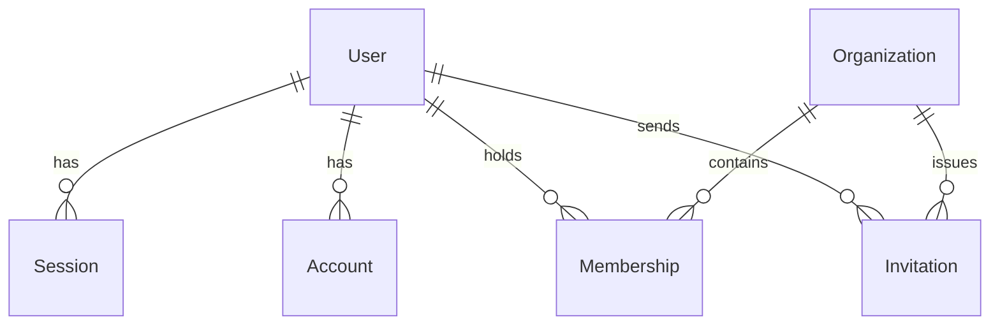

# Database

> Status: **Foundation schema** · Last updated: 2026-08-02
>
> Source of truth: [`packages/database/prisma/schema.prisma`](../packages/database/prisma/schema.prisma).

## Contents

1. [Stack](#1-stack)
2. [Tenancy model](#2-tenancy-model)
3. [Current schema](#3-current-schema)
4. [Conventions](#4-conventions)
5. [Client access](#5-client-access)
6. [Migrations](#6-migrations)
7. [Local setup](#7-local-setup)
8. [Seeding](#8-seeding)
9. [Performance](#9-performance)
10. [Planned models](#10-planned-models)

---

## 1. Stack

| Concern       | Choice                                                                        |
| ------------- | ----------------------------------------------------------------------------- |
| Engine        | PostgreSQL 16+                                                                |
| ORM           | Prisma (`prisma-client` generator, ESM output)                                |
| Client output | `packages/database/generated/prisma` (gitignored)                             |
| Config        | [`packages/database/prisma.config.ts`](../packages/database/prisma.config.ts) |
| Connection    | `DATABASE_URL` (pooled, runtime) · `DIRECT_URL` (unpooled, migrations)        |

**Why two URLs?** Serverless functions open many short-lived connections, which
exhausts Postgres' connection limit — so runtime goes through a pooler
(PgBouncer/Neon/Supabase). But Prisma Migrate needs session-level features a
transaction pooler does not support, so DDL goes direct. With a plain
non-pooled Postgres, set both to the same value.

## 2. Tenancy model

**Shared database · shared schema · `organizationId` discriminator.**

Every tenant-owned row carries `organizationId`, indexed. The active tenant is
resolved from `Session.activeOrganizationId` — deliberately on the session, not
the user, because one person may coach for several organizations and must be
able to switch without ambiguity.

Rationale and rejected alternatives: [ARCHITECTURE.md §6](./ARCHITECTURE.md#6-multi-tenancy).

## 3. Current schema

Only identity and tenancy exist. Feature tables arrive with their feature slice.



### Identity (Better Auth)

| Model          | Table           | Purpose                                    |
| -------------- | --------------- | ------------------------------------------ |
| `User`         | `users`         | Identity record                            |
| `Session`      | `sessions`      | Active sessions + `activeOrganizationId`   |
| `Account`      | `accounts`      | Credential and OAuth provider links        |
| `Verification` | `verifications` | Email verification & password reset tokens |

> Field names in these four models are dictated by the Better Auth Prisma
> adapter. **Do not rename them** — the adapter maps by field name.

### Tenancy

| Model          | Table           | Purpose                                                |
| -------------- | --------------- | ------------------------------------------------------ |
| `Organization` | `organizations` | The tenant. Unique `slug`, JSON `metadata`.            |
| `Membership`   | `memberships`   | User↔Organization with a role. Unique per pair.        |
| `Invitation`   | `invitations`   | Pending invites. Unique per `(organizationId, email)`. |

### Enums

- `MembershipRole` — `owner` · `admin` · `coach` · `athlete`
- `InvitationStatus` — `pending` · `accepted` · `rejected` · `expired`

Enums mirror the Zod enums in `@apex/types`, which are the source of truth for
the API surface. Change both together.

## 4. Conventions

| Rule                                                                 | Reason                                                                                                        |
| -------------------------------------------------------------------- | ------------------------------------------------------------------------------------------------------------- |
| `@id @default(cuid(2))`                                              | Sortable, collision-resistant, safe to expose in URLs — unlike sequential integers, which leak tenant volume. |
| `@@map("snake_case_plural")`                                         | Idiomatic Postgres table names, idiomatic TypeScript model names.                                             |
| `createdAt` / `updatedAt` on every model                             | Non-negotiable for debugging and audit.                                                                       |
| `organizationId` + `@@index([organizationId])` on every tenant model | Every tenant query filters on it; without the index each one is a sequential scan.                            |
| `onDelete: Cascade` on tenant relations                              | Deleting an organization must not leave orphans.                                                              |
| JSON only for genuinely unstructured data                            | Anything queried or validated gets promoted to a real column.                                                 |
| `///` doc comments for non-obvious fields                            | They surface in the generated client.                                                                         |

## 5. Client access

`@apex/database` is the **only** module that opens a database connection.

```ts
import { db } from '@apex/database';
```

The client is a module-level singleton, cached on `globalThis` in development so
Next.js hot reload does not open a new connection pool on every edit.

**Tenant-scoped access** goes through the helpers in
[`src/tenant.ts`](../packages/database/src/tenant.ts) rather than hand-written
`where` clauses. A forgotten filter is a cross-tenant data leak; routing scoping
through one module makes any deviation visible in review.

## 6. Migrations

```bash
pnpm db:generate              # regenerate the client after a schema change
pnpm db:migrate               # create + apply a migration (development)
pnpm db:push                  # push schema without a migration (prototyping only)
pnpm db:studio                # browse data
```

Rules:

1. **Never edit an applied migration.** Write a new one.
2. `db:push` is for local prototyping only — it produces no migration history.
3. Destructive changes ship in two steps: add the new column and backfill, then
   drop the old one in a later release. A single-step rename breaks every
   instance still running the previous deploy.
4. Migrations run in CI/CD, never by hand against production — see
   [DEPLOYMENT.md](./DEPLOYMENT.md).

## 7. Local setup

```bash
docker run --name apex-postgres \
  -e POSTGRES_PASSWORD=postgres \
  -e POSTGRES_DB=apex_os \
  -p 5432:5432 -d postgres:16

cp .env.example .env          # defaults already point at the container
pnpm db:generate
pnpm db:migrate
```

## 8. Seeding

[`prisma/seed.ts`](../packages/database/prisma/seed.ts) creates a development
organization with an owner. Run with `pnpm db:seed`. It is idempotent (upserts)
and must stay that way — a seed that only works on an empty database is a seed
nobody runs twice.

## 9. Performance

Guidance for when feature tables arrive:

- Index every column used in a `where`, `orderBy`, or join. Composite indexes
  lead with `organizationId` for tenant-scoped queries.
- Always paginate. Cursor pagination for feeds and infinite lists; offset only
  for jump-to-page tables. Use the shared schemas in `@apex/types/common/pagination`.
- Watch for N+1: prefer `include`/`select` over per-row lookups in a loop.
- `select` only the fields the caller needs; do not return whole rows by default.
- Wrap multi-write operations in `db.$transaction`.

_TBD:_ slow-query monitoring, connection-pool sizing per environment.

## 10. Planned models

Sketch only — each is designed with its feature slice.

| Slice         | Likely models                                                |
| ------------- | ------------------------------------------------------------ |
| `athletes`    | `Athlete`, `AthleteProfile`, `CoachAssignment`               |
| `training`    | `Exercise`, `TrainingPlan`, `PlanBlock`, `Session`, `SetLog` |
| `performance` | `MetricDefinition`, `MetricEntry`, `Goal`, `PersonalRecord`  |
| `nutrition`   | `NutritionPlan`, `MealEntry`, `NutritionTarget`              |
| `calendar`    | `CalendarEvent`, `Availability`, `Booking`                   |
| `chat`        | `Conversation`, `Message`, `Attachment`                      |
| `analysis`    | `Assessment`, `Benchmark`, `Report`                          |

---

**Related:** [ARCHITECTURE.md](./ARCHITECTURE.md) · [API.md](./API.md) ·
[SECURITY.md](./SECURITY.md)
